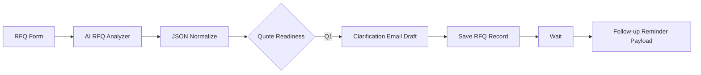

# AI Export RFQ Pre-Quote Automation

AI-powered pre-quote workflow for consumer electronics OEM/ODM manufacturers.

The system turns a messy overseas RFQ into structured manufacturing requirements, detects missing specifications, assigns a quote-readiness status, drafts buyer clarification questions, saves the opportunity record, and creates a follow-up reminder payload.

## Problem

Overseas RFQs often arrive as unstructured email or form text. Sales teams must manually extract product requirements, identify missing technical information, coordinate with engineering/procurement, and decide whether the request is ready for quotation.

This V1 focuses on the gap **before formal quotation**:

**Incoming RFQ → Requirement Understanding → Missing Specs → Quote Readiness → Clarification Draft → Save → Follow-up Reminder**

## Workflow



## Quote Readiness Model

| Status | Meaning | Action |
|---|---|---|
| Q0 | Insufficient RFQ | Request basic information |
| Q1 | Clarification Required | Ask buyer for missing technical/commercial details |
| Q2 | Ready for Internal Review | Route to engineering/procurement/compliance |
| Q3 | Ready to Quote | Prepare formal quotation |

The V1 production path currently demonstrates the **Q1 clarification workflow**.

## AI Analysis

For an AI Voice Recorder RFQ, the analyzer checks requirements such as:

- Product form / reference model
- Recording requirements
- Microphone configuration
- Storage capacity
- Battery / runtime
- Charging interface
- Bluetooth / Wi-Fi
- AI transcription scope
- App / cloud requirements
- Language requirements
- OEM / ODM customization scope
- Quantity

The AI is instructed not to invent missing specifications. Unknown requirements remain explicitly marked as `unknown`.

## Key Outputs

The workflow produces:

- Structured buyer and product information
- Requirement status for AR01–AR12
- Quote-readiness status and score
- Hard blockers
- Missing information list
- Recommended next action
- Internal routing suggestions
- Buyer clarification questions
- Chinese internal summary
- English clarification email draft
- Saved RFQ record in n8n Data Table
- Follow-up reminder payload after a demo wait interval

## Tech Stack

- **n8n Cloud** — workflow orchestration
- **OpenAI model via n8n** — RFQ analysis and clarification drafting
- **JavaScript Code node** — JSON parsing and status normalization
- **n8n Data Table** — RFQ record storage
- **GitHub** — portfolio, documentation, and versioned workflow export

## Reliability Design

AI-generated status labels are normalized in a Code node before routing. For example:

- `Clarification Required`
- `Q1 - Clarification Required`
- `Q1`

are normalized to:

```text
Q1
```

This prevents downstream Switch routing from breaking because of small LLM wording variations.

## Demo Scenario

Example buyer request:

> We are looking for 6,000 AI voice recorders for Sweden and the EU market. 64GB storage, Bluetooth, AI transcription, custom logo, CE/RoHS, target price below USD 33. We have not yet confirmed transcription languages, cloud vs on-device processing, recording specifications, battery runtime, or branded app requirements.

Expected result:

**Q1 — Clarification Required**

The workflow identifies the missing technical information and drafts a concise buyer clarification email before quotation.

See [`demo/demo-case.md`](demo/demo-case.md) for the full example.

## Current V1 Boundary

Included:

- RFQ capture
- AI requirement extraction
- Missing-spec detection
- Quote-readiness classification
- Q1 routing
- Clarification email drafting
- RFQ record storage
- Demo follow-up reminder generation

Not yet included:

- Automatic quotation/pricing
- ERP/BOM costing
- Real email sending
- CRM synchronization
- Engineering/procurement approval UI
- Multi-product industry knowledge library

These are intentionally excluded from V1 to keep the MVP focused on **pre-quote qualification**.

## Repository Structure

```text
.
├── README.md
├── demo/
│   └── demo-case.md
├── docs/
│   ├── architecture.md
│   └── quote-readiness.md
└── workflow/
    └── README.md
```

The exported n8n workflow JSON will be added under `workflow/` after credential-safe export.

## Project Goal

This project is designed as both:

1. A practical AI automation portfolio project; and
2. An MVP concept for helping export-oriented Chinese manufacturers reduce manual pre-quote work on complex OEM/ODM RFQs.

---

**Status:** V1 production workflow validated end-to-end in n8n Cloud.
